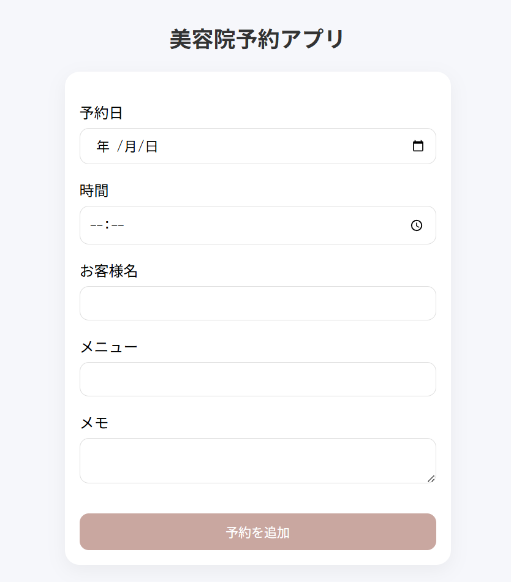
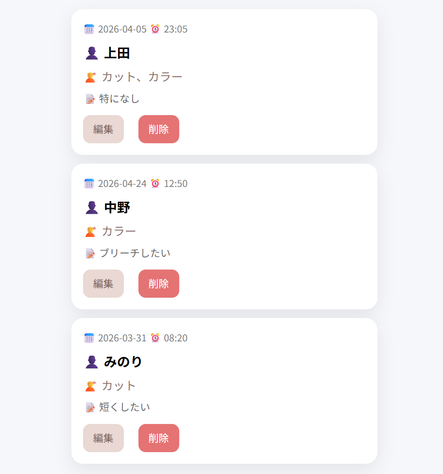

# 美容予約アプリ
美容院の予約を管理できるシンプルなWebアプリです。
予約の追加・編集・削除、一覧表示、今日の予約表示などの機能を実装しています。

## 公開URL
https://salon-booking-app-yy9a.onrender.com

## スクリーンショット

### 予約一覧

## 主な機能
‐ 予約の追加
‐ 予約の編集
‐ 予約の削除
‐ 予約一覧の表示
‐ 新しい順に並び替え
‐ 今日の予約のみ表示

## 使用技術
‐ Python(Flask)
‐ HTML / CSS
‐ JavaScript
‐ Render(デプロイ)
‐ Git / GitHub

## 工夫した点
‐ カードUIで見やすいデザインにした
‐ 今日の予約を分けて表示することで実用性を向上
‐ 並び替え機能で最新の予約を上に表示
‐ シンプルで使いやすいUIを意識

## 今後改善したい点
‐ データベース化(SQLite)
‐ ログイン機能追加
‐ 予約検索機能
‐ スマホ対応の強化

