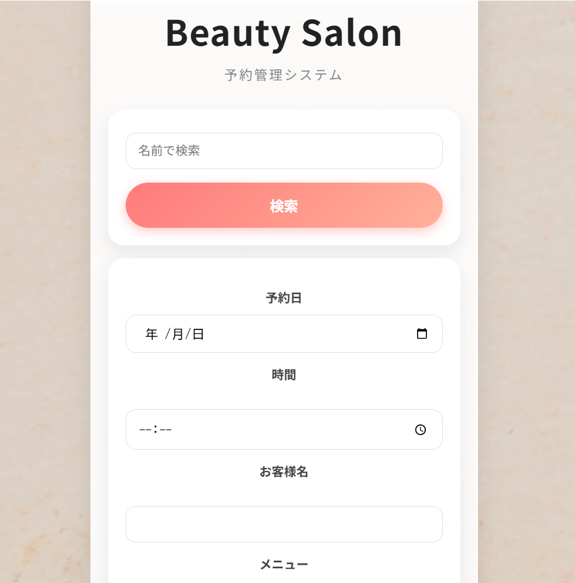
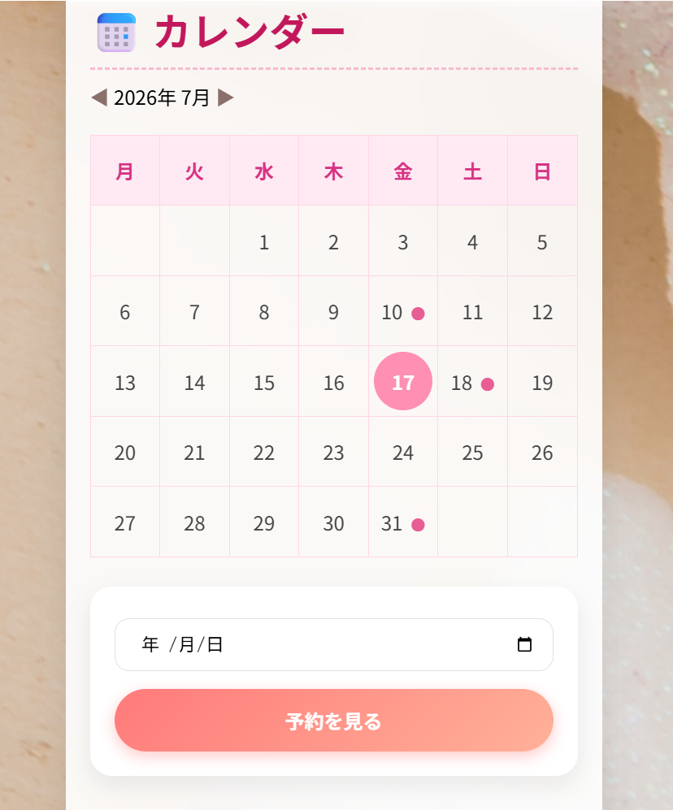
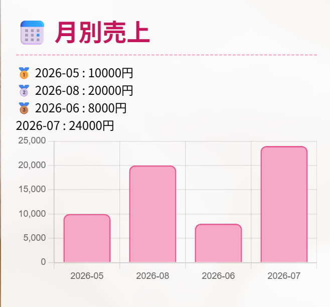

# 美容予約アプリ

美容院の予約を管理できるシンプルなWebアプリです。
予約の追加・編集・削除、一覧表示、今日の予約表示などの機能を実装しています。

## 公開URL

https://salon-booking-app-yy9a.onrender.com

## スクリーンショット

### トップ画面

### カレンダー

### 集計・グラフ

## 主な機能

‐ 予約の追加・編集・削除
‐ 名前によるキーワード検索
‐ 今日・未来・過去の予約を分けての表示
‐ メニューと担当者の選択
‐ カレンダー表示
‐ 前月・翌月への移動
‐ 1月・12月の年またぎ対応
‐ 今日の日付のハイライト表示
‐ 予約がある日にドットを表示
‐ カレンダーの日付クリックで予約内容を確認
‐ カレンダーからの予約の編集・削除
‐ 総売上の表示
‐ メニュー別予約件数
‐ スタッフ別予約件数・売上
‐ 月別売上の表示
‐ 月別売上の棒グラフ
‐ スマホ表示に対応

## 使用技術

‐ Python(Flask)
‐ SQLite
‐ HTML / CSS
‐ JavaScript
‐ Jinja2
‐ chart.js
‐ Render(デプロイ)
‐ Git / GitHub

## 工夫した点

‐ 今日・未来・過去の予約分けて表示し、必要な予約を確認しやすくしました。
‐ カレンダーから予約のある日を確認し、日付をクリックすると予約内容を表示できるようにしました。
‐ 今日の日付のハイライト、予約日のドット表示、前月・翌月への移動を実装しました。
‐ 予約内容の確認画面から、そのまま編集・削除できるようにしました。
‐ 総売上、メニュー別件数、スタッフ別件数・売上、月別売上を集計しました。
‐ 月別売上は棒グラフでも確認できるようにしました。
‐ 美容院らしい大人可愛いデザインと、見やすい余白・配色を意識しました。
‐ パソコンとスマートフォンの両方で見やすいように調整しました。

## 今後改善したい点

‐ ログイン機能とユーザー権限の追加
‐ 予約時間の重複チェック
‐ スタッフごとの空き時間管理
‐ メニュー・料金のデータベース管理
‐ 入力内容のチェックとエラー表示の強化
‐ 自動テストの追加
